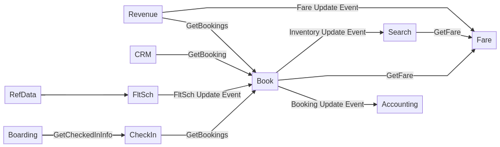

# Steins Gate Airline
Steins Gate Airline is a fictitious airline whose system is built with microservices-based architecture. All the applications in this Git repository are developed with Spring Boot 2.3.0 and below libraries:

- Spring Cloud Circuit Breaker
- Spring Cloud Gateway
- Spring Cloud Netflix Eureka
- Spring Cloud Security
- Spring Cloud Stream
- Spring Data REST
- Spring Kafka
- Spring REST Docs
- Spring Security
- [Java Money](https://github.com/JavaMoney/jsr354-ri)

- [Jackson DataType Money](https://github.com/zalando/jackson-datatype-money)

- [Lombok](https://projectlombok.org/)

Database is Mongo DB.

Message broker is Apache Kafka.

Identity provider is [Okta](https://www.okta.com/).

## Architecture

- **Search**: flight availability between cities for a given date
- **Flight Schedule (FltSch)**: flight schedule, flight routing
- **Fare**: fare between cities for a given date

- **Booking**: passenger booking on a selected flight and date. It also maintains the number of seats available on a flight and date.

- **Check In**
- **Boarding**
- **CRM**: Customer Relationship Management
- **Revenue Management**: Fare calculations based on forecasts
- **Accouting**: Invoicing and Billing
- **Reference Data**: Country, City, Aircrafts, Currency, Exchange Rate

## Developed Applications

Currently only below applications are developed. Others will be developed later.

- Discovery: a Eureka server for service discovery
- API Gateway: provide route to APIs and security
- Flt Sch
- Booking
- Search

Visit the `README.md` under their directory for individual application details.