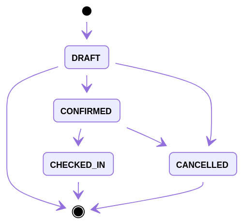

# Booking

This is a booking application. It manages passenger booking and flight inventory.

## RESTful API

The `index.html` in the current directory (booking) provides more details about the RESTful APIs of this application. This HTML file is generated with Spring REST Docs, a test-driven approach which helps to guarantee the accuracy of API's documentation. In reality this HTML file should be published to web (either internal or external) rather than keep in Git. This HTML copy here is for demonstration as my applications are not running on a cloud server with a public IP address.

### Booking

- List bookings
- Create a booking
- Get a booking
- Update a booking
- Confirm, check-in, cancel a booking: follow HATEOAS principle

Currently the check-in API is exposed because the application `check-in` is not implemented yet. 

## Adopted Framework and Library

- Spring Boot
- Spring Cloud Netflix
- Spring Cloud Stream (Kafka binder)
- Spring Data Mongo DB

- Spring Data REST
- Spring REST Docs
- Spring Security 5
- [Java Money](https://github.com/JavaMoney/jsr354-ri)
- [Jackson DataType Money](https://github.com/zalando/jackson-datatype-money)

- [Lombok](https://projectlombok.org/)

## Implementation Details

### Booking Resource

Booking is persisted to Mongo DB. A unique index guarantees the uniqueness of a flight. 

Spring Data REST exposes the booking domain as hypermedia-driven HTTP resources. Java and Jackson getters and setters guarantees what properties can be serialized to JSON and seen by clients, and what properties can be modified by clients. JSR-303 and JSR-380 bean validation are used for booking input data validation.

Auditing are enabled to record created user and time, and last modified user and time. The user info is retrieved from the OAuth 2.0 JWT.

The initial booking status is `DRAFT`. The status transition follows HATEOAS principle. Below image describes the valid status transition. Invalid status transition HTTP request is forbidden and gets a response with bad request 400 HTTP status code.

Whenever a booking is confirmed, checked-in or cancelled, a booking event is sent to Kafka using Spring Cloud Stream.

### Inventory

When a flight created event is received from Kafka, an inventory is created with initial seat available 100. 

When a booking is confirmed, the inventory is subtracted if enough. When a confirmed booking is cancelled, the inventory is added back. Both booking and inventory operations are handled in a Mongo DB transaction.

The inventory is not exposed as HTTP resource. To search inventory available, go to application `search`.

